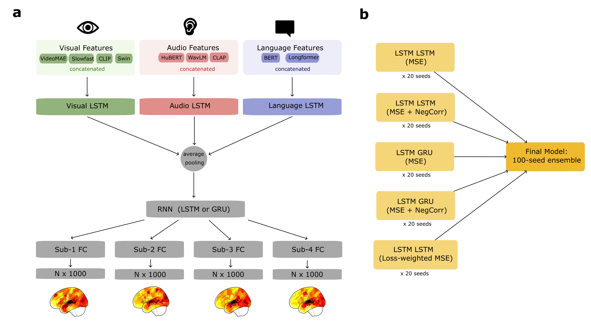
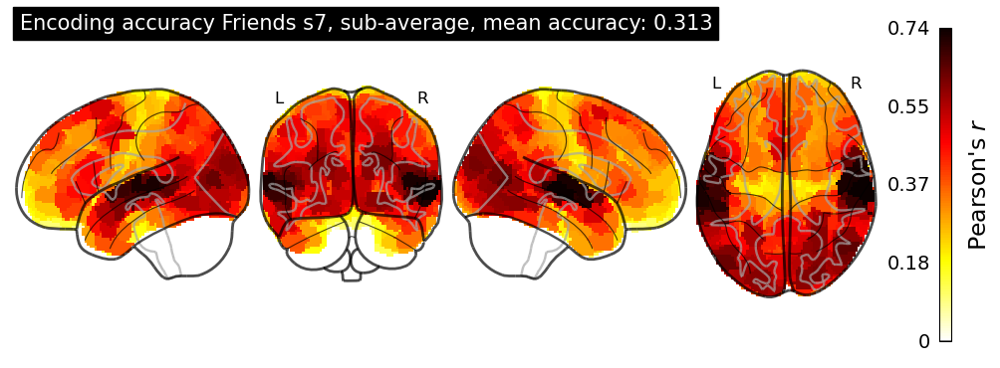
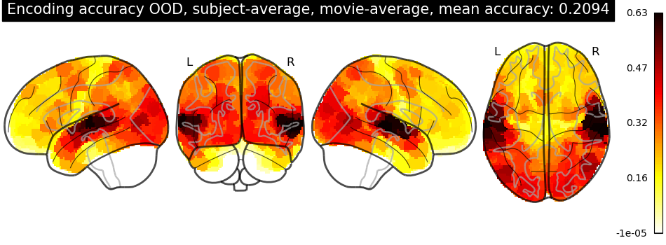

## Collaborators
- Semih Eren ([erensemih97@outlook.com](erensemih97@outlook.com))
- Deniz Kucukahmetler([denizkahmetler@gmail](denizkahmetler@gmail))

## Report Link
[https://arxiv.org/abs/2507.17897](https://arxiv.org/abs/2507.17897)

## Model Architecture


## Requirements

Before running the pipeline, please install the required dependencies:

```bash
pip install -r requirements.txt
```

## Usage

After installing the requirements, you can run the main script to execute the entire pipeline:

```bash
python main.py
```

## Pipeline Details
Before training, you should download stimuli and fMRI data via DataLad from the competition GitHub repository and place them in the same directory as the src folder.
When you run main.py, it will first extract visual, audio, and language features for the movies defined in the ALL_MOVIES parameter in src/features/feature_config.py. By default for quick trials, this includes only Friends Seasons 6 and 7, and ood movies; to process all movies, update the ALL_MOVIES list accordingly.

To ensure all movies with extracted features are included in model training, set the MOVIES parameter in src/training/training_config.py to your desired list of movies.

Once these configurations are set, main.py will proceed through feature extraction followed by model training and evaluation.


## Results

## Friends Season 7 Final Results


## Ood Final Results
